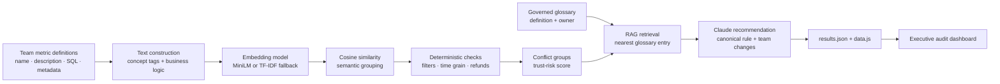

<div align="center">

# MetricGuard

### AI-powered metric consistency auditing for analytics teams

Detect semantically equivalent business metrics, identify conflicting SQL logic, retrieve the governed definition, and generate an actionable resolution.

[](https://www.python.org/)
[](https://docs.anthropic.com/)
[](https://www.sbert.net/)
[](output/dashboard.html)

[Overview](#overview) · [Architecture](#system-architecture) · [Concepts](#core-concepts) · [Quick Start](#quick-start) · [Results](#demo-results)

</div>

---

## Overview

Analytics teams often implement the same KPI independently:

- Finance calculates **monthly revenue** from completed orders.
- Sales includes pending and refunded orders in **monthly revenue**.
- Marketing subtracts refunds but includes shipped orders.

The names look equivalent, yet the SQL produces different numbers. These disagreements spread into dashboards, forecasts, leadership reports, and business decisions.

**MetricGuard turns that ambiguity into an auditable workflow:**

1. Read metric definitions from multiple teams.
2. Convert their names, descriptions, and SQL into vector representations.
3. Group definitions that appear to describe the same business concept.
4. Compare their filters, time windows, and refund handling.
5. Assign an interpretable trust-risk score.
6. Retrieve the relevant canonical entry from a governed glossary.
7. Generate a team-by-team remediation recommendation.
8. Publish the findings as JSON and an executive dashboard.

> MetricGuard is a focused prototype for metric-governance workflows. It demonstrates the detection and resolution pipeline on a synthetic dataset; it is not a replacement for a production semantic layer or SQL parser.

---

## Why This Project Matters

Metric inconsistency is rarely a simple naming problem. It is a **definition problem**:

| Source of disagreement | Example |
|---|---|
| Population | Completed orders vs. all orders |
| Time window | Calendar month vs. trailing 30 days |
| Event eligibility | Any event vs. login events only |
| Refund treatment | Gross amount vs. net of refunds |
| Denominator | All orders vs. completed orders |

Traditional string matching may miss aliases such as `MAU`, `active_users`, and `monthly_active_users`. Pure LLM generation can produce fluent but ungoverned advice. MetricGuard combines deterministic checks, semantic retrieval, and a governed glossary so recommendations remain explainable.

---

## Demo Results

The included synthetic organization contains 12 definitions distributed across six teams.

<div align="center">

| Definitions scanned | Conflicting definitions | Conflict groups | Teams affected | Peak trust risk |
|:---:|:---:|:---:|:---:|:---:|
| **12** | **8 (66.7%)** | **3** | **6** | **85 / 100** |

</div>

### Detected conflict groups

| Concept | Teams | Primary disagreement | Risk |
|---|---|---|:---:|
| Monthly Revenue | Finance, Marketing, Sales | Refund handling and order-status filters | **85** |
| Monthly Active Users | Data, Growth, Product | Calendar month vs. rolling 30 days; login-only filtering | **85** |
| Average Order Value | Finance, Growth | Refund subtraction and completed-order filtering | **50** |

Open [`output/dashboard.html`](output/dashboard.html) locally to explore each conflicting definition, its SQL, detected issues, similarity score, glossary owner, and recommended migration.

---

## System Architecture



### Pipeline responsibilities

| Stage | Implementation | Purpose |
|---|---|---|
| Ingestion | `data/metric_definitions.json` | Represents definitions collected from dashboards, SQL models, notebooks, or catalogs |
| Text construction | `build_text()` in `src/engine.py` | Combines metric name, description, SQL, and concept hints |
| Embedding | `embed()` in `src/engine.py` | Converts each definition into a normalized vector |
| Semantic grouping | `find_semantic_groups()` | Groups definitions above a configurable similarity threshold |
| Conflict detection | `detect_definition_conflicts()` | Checks differences in filters, time grain, and refund behavior |
| Risk scoring | `trust_risk_score()` | Converts team count and conflict count into a 0–100 prioritization score |
| RAG retrieval | `retrieve_glossary_entry()` in `src/genai.py` | Selects the closest governed definition |
| Recommendation | `resolve_conflict()` | Builds grounded context and generates a canonical migration plan |
| Reporting | `src/report.py` | Writes machine-readable and browser-readable artifacts |

---

## Core Concepts

### 1. Embeddings

An embedding maps text to a numeric vector. Definitions with similar meaning should have vectors pointing in similar directions, even when their wording differs.

MetricGuard embeds a combined representation:

`metric name + description + SQL logic + concept tags → normalized vector`

The preferred model is `all-MiniLM-L6-v2` from SentenceTransformers. If the neural model cannot be loaded, the application falls back to TF-IDF so the project remains runnable offline.

### 2. Cosine Similarity

Cosine similarity measures the angle between two vectors:

`similarity(A, B) = (A · B) / (||A|| × ||B||)`

Because MetricGuard normalizes vectors to unit length, similarity becomes a matrix multiplication: `V @ V.T`. Values closer to `1.0` indicate stronger semantic similarity.

This project performs an all-pairs comparison because the demo dataset is small. At production scale, the same retrieval pattern would typically use an approximate-nearest-neighbor index or vector database.

### 3. Semantic Grouping

Definitions whose similarity exceeds the configured threshold are grouped as candidate representations of the same metric. This enables the system to connect aliases such as:

- `MAU`
- `active_users`
- `monthly_active_users`

Semantic similarity alone does **not** prove a conflict. It identifies candidates for the next deterministic validation step.

### 4. Deterministic Conflict Detection

After grouping similar definitions, MetricGuard compares structured attributes:

- `filters`
- `time_grain`
- `includes_refunds`

This separation is intentional:

- **Embeddings answer:** “Do these definitions appear to describe the same concept?”
- **Rules answer:** “Do they calculate that concept differently?”

The result is easier to audit than asking an LLM to infer every difference directly from raw SQL.

### 5. Trust-Risk Scoring

The risk score prioritizes conflicts using:

- the number of teams depending on the metric;
- the number of incompatible definition attributes.

It is a transparent prioritization heuristic, not a statistically calibrated probability. Organizations can replace it with a model that also considers dashboard usage, executive visibility, financial impact, or query frequency.

### 6. Retrieval-Augmented Generation

RAG adds governed context before generation:

1. Build a query from the conflicting names and descriptions.
2. Embed the query and all glossary entries.
3. Retrieve the glossary entry with the highest similarity.
4. Add the official definition and owner to the LLM prompt.
5. Ask the model for a canonical rule, per-team changes, and executive impact.

This design reduces the chance that the model invents a definition and makes the source of truth visible in every result.

### 7. Claude Integration

When `ANTHROPIC_API_KEY` is available, MetricGuard uses the official Anthropic Python SDK with:

- Claude Opus 4.7;
- adaptive thinking for dynamic reasoning depth;
- prompt caching on the stable system instructions;
- graceful fallback when the API is unavailable.

Without an API key, the pipeline uses concept-specific precomputed recommendations. This keeps local demos deterministic while clearly separating live generation from fallback output.

---

## Repository Structure

```text
MetricGuard/
├── data/
│   ├── glossary.json             # Canonical concepts, definitions, and owners
│   └── metric_definitions.json   # Synthetic cross-team metric definitions
├── output/
│   ├── dashboard.html            # Self-contained visual audit console
│   ├── data.js                   # Dashboard payload generated by report.py
│   └── results.json              # Structured pipeline output
├── src/
│   ├── engine.py                 # Embedding, grouping, checks, and risk scoring
│   ├── genai.py                  # Glossary retrieval and Claude recommendations
│   └── report.py                 # End-to-end orchestration and artifact generation
├── .gitignore
├── Makefile
├── README.md
└── requirements.txt
```

---

## Quick Start

### Prerequisites

- Python 3.9 or newer
- `pip3`
- Optional: an Anthropic API key for live recommendations

### 1. Clone and install

```bash
git clone https://github.com/rajstories/MetricGuard-.git
cd MetricGuard-
make install
```

Equivalent installation without `make`:

```bash
pip3 install -r requirements.txt
```

### 2. Run the full pipeline

```bash
make run
```

This runs the semantic engine, the RAG/LLM layer, and the report generator.

### 3. Open the dashboard

```bash
open output/dashboard.html
```

On Linux, use `xdg-open output/dashboard.html`, or open the file manually in a browser.

### Optional: enable live Claude recommendations

Set the key in your environment without committing it:

```bash
export ANTHROPIC_API_KEY="your-api-key"
make report
```

The repository ignores `.env` files, but MetricGuard reads the key directly from the process environment.

---

## Commands

| Command | Description |
|---|---|
| `make install` | Install Python dependencies |
| `make engine` | Run semantic matching and conflict detection |
| `make genai` | Run glossary retrieval and recommendation generation |
| `make report` | Regenerate `output/results.json` and `output/data.js` |
| `make run` | Execute the complete pipeline |
| `make clean` | Remove Python cache files |

Direct Python commands are also supported:

```bash
python3 src/engine.py
python3 src/genai.py
python3 src/report.py
```

---

## Input Data Model

### Metric definition

Each object in `data/metric_definitions.json` contains:

```json
{
  "id": "m01",
  "team": "Finance",
  "metric_name": "monthly_revenue",
  "description": "Total revenue from completed orders, grouped by month.",
  "sql": "SELECT ...",
  "filters": ["status = 'completed'"],
  "includes_refunds": false,
  "time_grain": "month"
}
```

Required fields are `id`, `team`, `metric_name`, `description`, and `sql`. Structured metadata enables deterministic comparison and can later be extracted from a SQL abstract syntax tree instead of being supplied manually.

### Governed glossary entry

Each object in `data/glossary.json` contains:

```json
{
  "concept": "Revenue (Monthly)",
  "official_definition": "Net revenue for completed orders, grouped by calendar month...",
  "owner": "Finance"
}
```

The glossary is the source of truth used by the RAG stage.

---

## Output Contract

`output/results.json` contains:

- headline KPIs;
- ranked conflict groups;
- involved teams and definition IDs;
- average semantic similarity;
- detected conflict reasons;
- trust-risk score;
- retrieved glossary concept and owner;
- retrieval similarity;
- generated or precomputed recommendation.

`output/data.js` contains the same payload as a JavaScript constant so the dashboard can be opened directly from the filesystem without running a web server.

---

## Design Decisions

### Why combine semantic and deterministic methods?

Embeddings are good at finding aliases and related descriptions, but they should not be trusted to prove business-rule equivalence. Deterministic metadata checks make the final conflict decision inspectable.

### Why use a governed glossary?

The model should not choose the organization's metric definition from general knowledge. The glossary provides the official definition and accountable owner.

### Why include an offline fallback?

Portfolio demos, CI environments, and local development should not fail because a model download or API key is unavailable. The fallback preserves the workflow while keeping live LLM use optional.

### Why a static dashboard?

A self-contained HTML report is easy to share, requires no backend, and makes the project immediately reviewable. A production version could expose the same result schema through an API and persist historical audits.

---

## Current Limitations

- The dataset is synthetic and intentionally small.
- SQL is displayed and compared through supplied metadata; it is not yet parsed into an AST.
- Concept tags provide domain hints for the offline TF-IDF path.
- Semantic grouping uses a simple threshold and first-pass grouping rather than graph clustering.
- Risk scoring is heuristic rather than learned from real business impact.
- Precomputed recommendations are used when no Anthropic API key is present.
- There are no connectors yet for dbt, Looker, Tableau, notebooks, or warehouse query history.

These constraints keep the prototype understandable and runnable while leaving a clear path to production hardening.

---

## Production Roadmap

- Parse SQL with `sqlglot` to compare expressions, joins, filters, and aggregation grain.
- Add dbt manifest, LookML, Tableau, and warehouse metadata connectors.
- Persist embeddings and lineage in a vector index and relational store.
- Replace threshold grouping with connected-components or density-based clustering.
- Track approvals, owners, exceptions, and definition version history.
- Add tests for retrieval quality, conflict precision, and recommendation grounding.
- Expose an API and scheduled audit workflow.
- Add authentication and organization-level glossary permissions.

---

## What This Project Demonstrates

- Semantic text representation with embeddings
- Vector similarity and retrieval
- Hybrid ML + rule-based decision systems
- RAG grounded in governed enterprise knowledge
- Anthropic SDK integration
- Prompt caching and graceful degradation
- Data pipeline orchestration
- Explainable risk scoring
- Executive-facing data product design

---

## Responsible Interpretation

The KPI values in this repository describe the included demo dataset only. They should not be interpreted as measured enterprise savings or production accuracy. Real-world deployment requires representative data, validated thresholds, access controls, SQL parsing, monitoring, and human approval of canonical definitions.

---

<div align="center">

**MetricGuard converts “same metric, different number” into a visible, explainable, and actionable governance workflow.**

</div>
